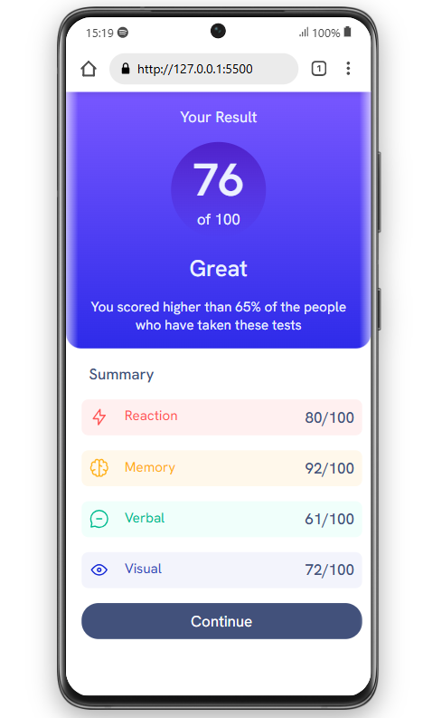
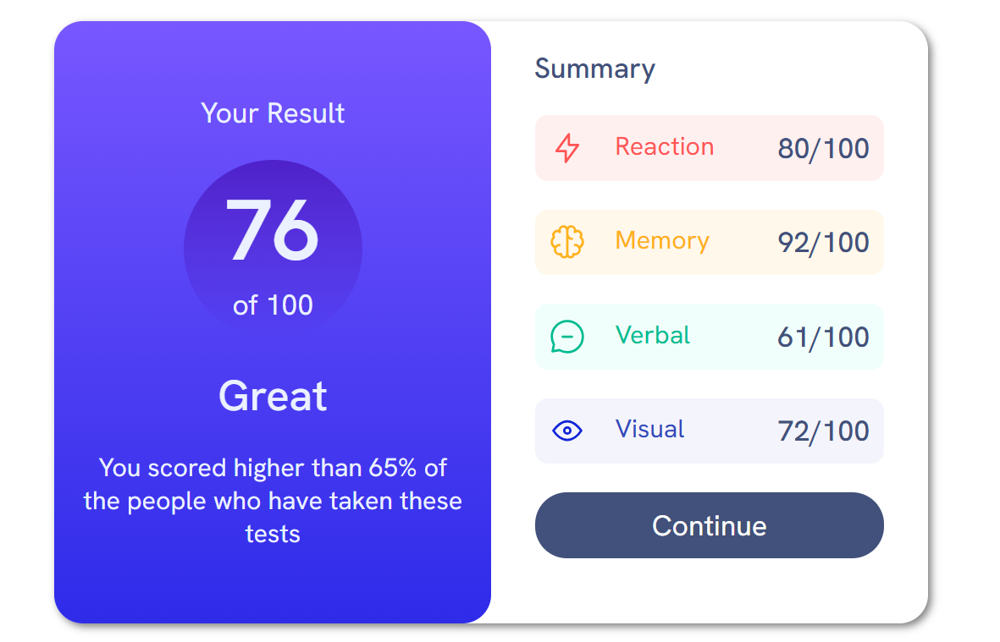

# challenge_result-summary-componet

## Sobre o Projeto

link do projeto: (https://oliveiracleiton.github.io/challenge_result-summary-componet/)

Essa é a minha solução para o desafio proposto pelo Frontend Mentor. (https://www.frontendmentor.io/)
Neste projeto, foquei na criação de uma estrutura semântica em HTML5 e desenvolvi o layout com uma abordagem mobile-first e design responsivo. 
Para otimizar o CSS, utilizei SASS e apliquei a metodologia BEM, reforçando e consolidando conhecimentos em CSS3 e práticas modernas de desenvolvimento frontend.

## Layout Mobile

## Layout Desktop

## Tecnologias utilizadas
- **HTML5** - Marcação do conteúdo e estrutura da página.
- **CSS3/SASS** - Estilização da interface, responsividade e organização de estilos.
